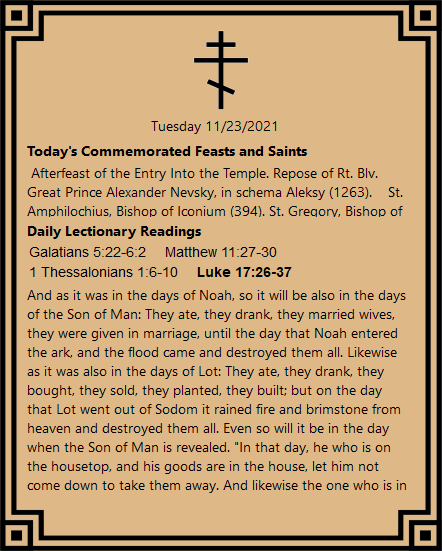

# Orthodox Lectionary Desktop Overlay
An elegant desktop overlay with daily commemorations and lectionary readings for Orthodox Christians.
The program is completely offline and follows the "new calendar" Orthodox liturgical cycle.

Readings are taken from the New King James Version (NKJV), the same version used in the popular Orthodox Study Bible.

## Installation
1. Download the zipped installation file. <a href="https://github.com/dervayja/LectionaryOverlay/releases/download/v0.0.2-beta/v0.0.2-beta.zip" download>Click here to download</a>.
2. If promped to keep or discard the file, choose keep.
3. Extract the zipped folder to any location.
4. Run Setup.exe. Choose "Run Anyway" if promped. The program will install itself to the user's %AppData% location and automatically launch.
5. The downloaded/ extracted files can be deleted.

## Usage
The overlay is controlled by right-clicking the icon docked in the system tray.

The background color is customizable to look great with any destop background.

To relocate the window, select "Move Position..." 

A window bar will apear at the top of the overlay. Drag and drop the the overlay to the desired position. Click the Cross to lock-in the position.

The overlay is interactive. Click a reading to view the contents. Scroll over the text and reading selections to see more.
